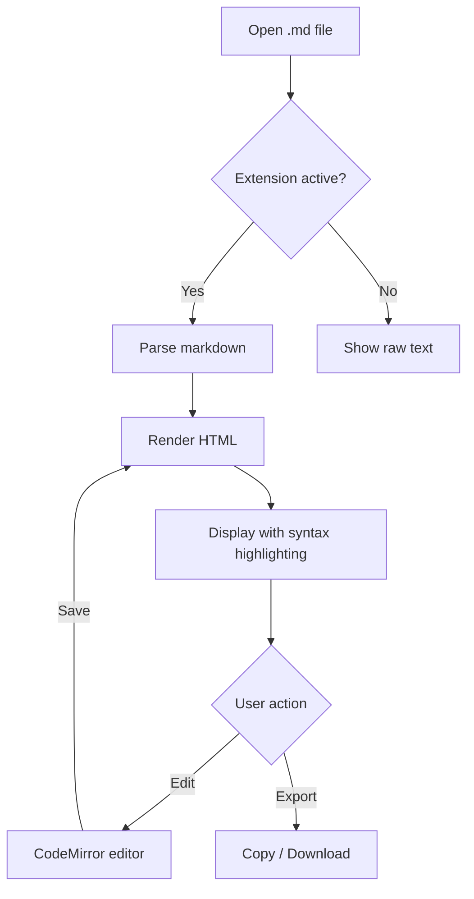
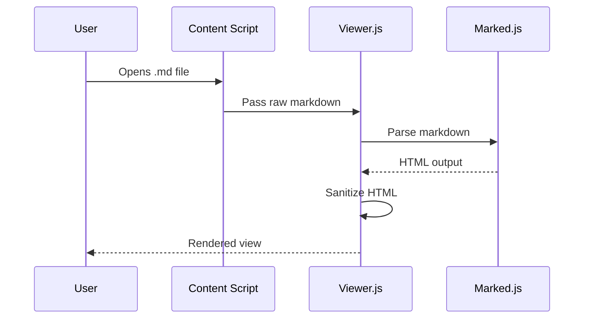

# Light MD Viewer - Feature Demo

## Text Formatting

This is **bold**, this is *italic*, this is ~~strikethrough~~, and this is `inline code`.

Here's a [link to GitHub](https://github.com) and an autolinked URL: https://example.com

> This is a blockquote.
> It can span multiple lines.
>
> > And even be nested.

---

## Headings

### Third Level
#### Fourth Level
##### Fifth Level

---

## Lists

### Unordered
- Item one
- Item two
  - Nested item
  - Another nested
- Item three

### Ordered
1. First step
2. Second step
3. Third step
   1. Sub-step A
   2. Sub-step B

### Task List (Checkboxes)
- [x] Design the UI
- [x] Implement markdown parsing
- [ ] Add dark mode support
- [ ] Write documentation
- [x] Fix code block rendering bug

---

## Code Blocks

### JavaScript
```js
function greet(name) {
  const message = `Hello, ${name}!`;
  console.log(message);
  return message;
}

greet("World");
```

### Python
```python
def fibonacci(n):
    """Generate Fibonacci sequence up to n terms."""
    a, b = 0, 1
    for _ in range(n):
        yield a
        a, b = b, a + b

print(list(fibonacci(10)))
```

### HTML (tests escaping)
```html
<div class="container">
  <h1>Hello &amp; Welcome</h1>
  <p>Use &lt;br&gt; for line breaks</p>
  
  <script>alert("This should show as code, not execute!")</script>
</div>
```

### No Language Specified
```
This is a plain code block with no language.
It should still be formatted as code.
Special chars: < > & " ' ` ~ ! @
HTML entities: &amp; &lt; &gt; &nbsp; &copy;
```

### Inline Code
Use `git commit -m "message"` to commit. The expression `5 > 3 && x < 10` is a comparison.

---

## Tables

| Feature | Status | Priority |
|---------|--------|----------|
| Markdown rendering | Done | High |
| Code highlighting | Done | High |
| Mermaid diagrams | Done | Medium |
| Task lists | In Progress | Medium |
| Dark mode | Planned | Low |

### Alignment

| Left | Center | Right |
|:-----|:------:|------:|
| L1   | C1     |   100 |
| L2   | C2     |  2500 |
| L3   | C3     | 38000 |

---

## Images


---

## Mermaid Diagrams

### Flowchart


### Sequence Diagram


---

## Emoji (Unicode)

Thumbs up: :+1: | Rocket: :rocket: | Check: :white_check_mark:

Since this viewer doesn't use a GitHub emoji plugin, use actual Unicode instead:
Thumbs up: 👍 | Rocket: 🚀 | Check: ✅ | Fire: 🔥 | Star: ⭐ | Warning: ⚠️

---

## Nested / Complex Structures

### Blockquote with Code
> To install, run:
> ```bash
> npm install && npm run build
> ```
> Then load the extension in Chrome.

### List with Code
1. Clone the repo:
   ```bash
   git clone https://github.com/user/repo.git
   ```
2. Install dependencies:
   ```bash
   npm install
   ```
3. Build:
   ```bash
   npm run build
   ```

---

## HTML Entities in Code (Issue #1 Demo)

This section tests that `&amp;`, `&lt;`, and `&gt;` display correctly inside code blocks.

```
Literal entities that should display AS-IS (not be decoded):
  &amp;   should show as: &amp;
  &lt;    should show as: &lt;
  &gt;    should show as: &gt;
  &nbsp;  should show as: &nbsp;
  &copy;  should show as: &copy;

If you see & < > (space) (c) instead, escaping is broken.
```

---

## Horizontal Rules

Three styles (all render the same):

---
***
___

---

## Definition-style Content

**Term 1**
: This uses bold + indented text to simulate a definition list.

**Term 2**
: Another simulated definition.

---

*End of demo. If everything above renders correctly, the viewer is working!*
