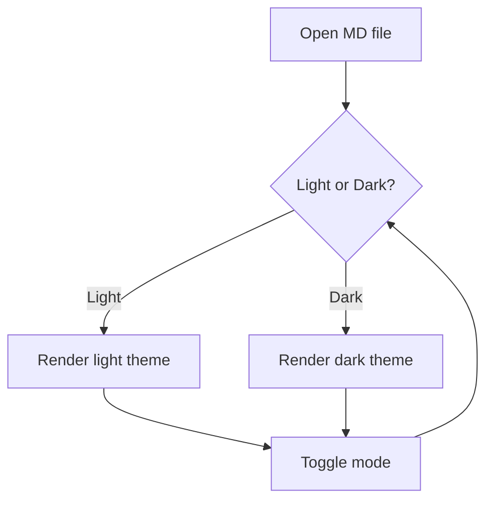
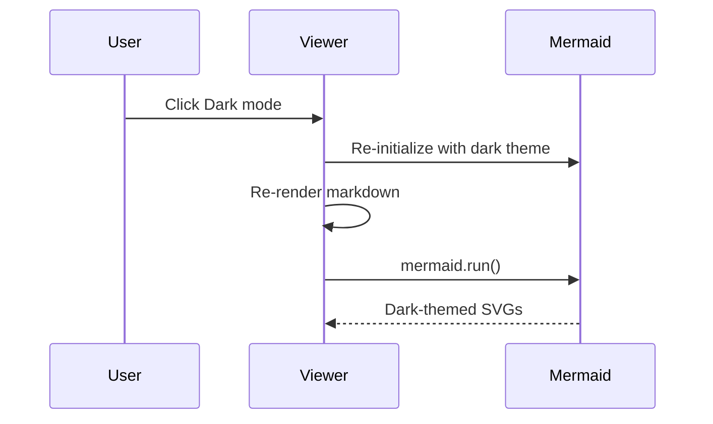
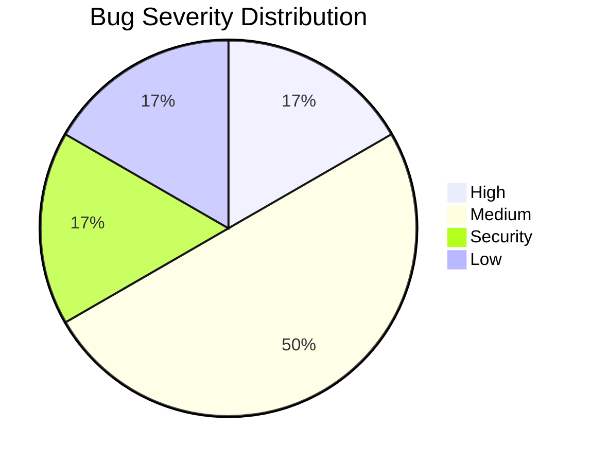

# Bug 3: Dark Mode Mermaid Re-rendering

## What this tests

Mermaid diagrams should update their color theme when toggling between light and dark mode. Previously, diagrams stayed in the original theme because the toggle didn't re-render the markdown.

## How to test

### Step 1: View in light mode

The diagrams below should render with a **light theme** (dark text on light background).

### Step 2: Toggle dark mode

Click the **Dark** button in the toolbar. All diagrams should re-render with a **dark theme** (light text on dark background).

### Step 3: Toggle back to light

Click the **Light** button. Diagrams should return to the light theme.

---

## Flowchart

## Sequence diagram

## Pie chart

## What the bug looked like before the fix

1. Open this file (light mode) - diagrams render with dark text, light backgrounds
2. Click Dark - page goes dark but **diagrams kept their light colors** (white backgrounds on dark page, unreadable)
3. The fix re-renders the full markdown on theme toggle, producing fresh mermaid source blocks that get processed with the new theme
