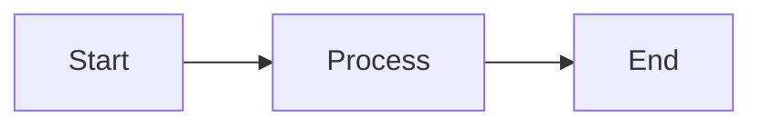

# Bug 4: Mermaid Syntax Error Handling

## What this tests

A mermaid block with invalid syntax should fail gracefully without causing an unhandled promise rejection. The rest of the page should render normally.

## How to test

1. Open this file in the extension
2. The valid diagram below should render correctly
3. The invalid diagram should show an error or raw text (not crash the page)
4. Open Chrome DevTools (F12) Console - there should be a `warn` message, NOT an unhandled promise rejection error
5. All content below the broken diagram should still be visible

---

## Valid diagram (should render)



## Invalid diagram (should fail gracefully)

```mermaid
this is not valid mermaid syntax
    --> broken arrows
    ??? undefined node types
    [[[ unclosed brackets
```

## Content after the broken diagram

If you can read this paragraph, the page survived the mermaid error without crashing.

Here's a table to confirm the rest of rendering works:

| Check | Expected |
|-------|----------|
| Valid mermaid above | Renders as flowchart |
| Invalid mermaid above | Shows error or raw text |
| This table | Renders normally |
| Console | `warn` level, not unhandled rejection |

### Code block (should have syntax highlighting)

```python
def test_graceful_failure():
    """Everything after a broken mermaid block should render fine."""
    assert page_is_visible == True
    assert console_has_no_unhandled_rejections == True
```

## What the bug looked like before the fix

The `mermaid.run()` promise rejection went unhandled. Chrome logged `Unhandled promise rejection` errors in the console. While the page usually survived, repeated errors could interfere with subsequent mermaid.run() calls in split-mode live preview.
